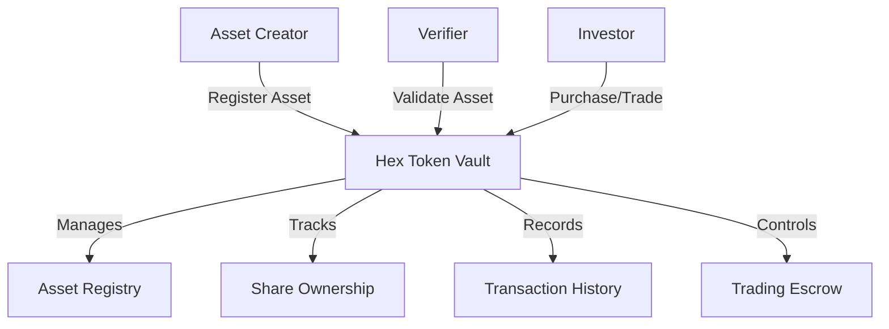

# Tip Hexadecimal Package: Digital Asset Tokenization

A powerful Stacks blockchain platform for secure, flexible digital asset tokenization and fractional ownership management.

## Overview

The Tip Hexadecimal Package provides a robust infrastructure for digitizing and trading assets through smart contracts. Key features include:

- Flexible digital asset tokenization
- Fractional ownership capabilities
- Secure, transparent trading mechanisms
- Comprehensive ownership tracking
- Advanced verification processes

## System Architecture



## Key Components

1. **Asset Registry**: Centralized digital asset management
2. **Fractional Ownership**: Granular investment options
3. **Verification System**: Trusted asset validation
4. **Trading Mechanism**: Secure, transparent transfers
5. **Ownership Tracking**: Comprehensive transaction history

## Prerequisites

- Clarinet
- Stacks Wallet
- STX Tokens

## Quick Start

### Asset Registration

```clarity
(contract-call? .hex-token-vault register-asset 
    "Digital Asset Description" 
    "Asset Category" 
    "Origin Location" 
    asset-value 
    is-fractional 
    total-shares 
    royalty-rate 
    "metadata-url")
```

### Asset Verification

```clarity
(contract-call? .hex-token-vault verify-asset asset-id)
```

## Security Considerations

- Strict ownership validation
- Escrow-protected transactions
- Immutable verification process
- Share transfer restrictions

## Development

### Testing
```bash
clarinet test
```

### Local Deployment
```bash
clarinet console
clarinet deploy
```

## Limitations

- Maximum 1,000,000 shares per asset
- 50% maximum royalty rate
- No direct STX refunds
- Locked assets have transfer restrictions

## License

[Insert License Information]

## Contributing

[Contribution Guidelines]